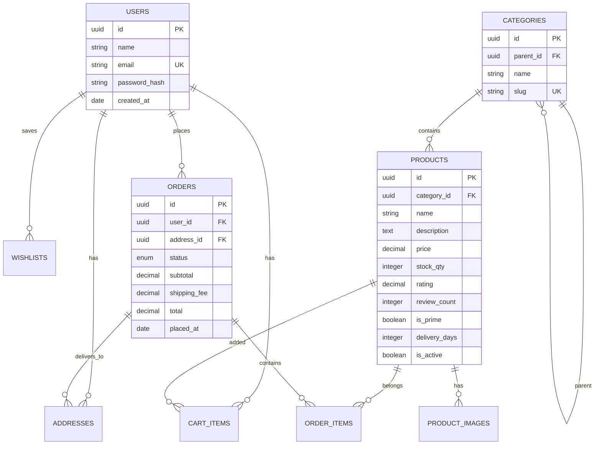

# 🛒 Amazon Clone — Fullstack SDE Intern Assignment

A fully functional, high-fidelity e-commerce web application replicating **Amazon's complete user experience, UI design, and transaction flow**.

🚀 **Live Frontend URL (Vercel)**: [https://amazon-clone-gray-zeta.vercel.app](https://amazon-clone-gray-zeta.vercel.app)  
🛰️ **Live Backend API (Render)**: [https://amazon-clone-nv1k.onrender.com](https://amazon-clone-nv1k.onrender.com)  
📁 **Public GitHub Repository**: [https://github.com/shruti-ghoshhhh/Amazon_Clone](https://github.com/shruti-ghoshhhh/Amazon_Clone)

---

## 🛠️ Technical Stack
* **Frontend**: React.js (Single Page Application) with **Vite** (extremely fast compilation & HMR), React Router, and Axios (centralized API client).
* **Styling**: Pure **Vanilla CSS** for maximum precision, control, and zero bloated framework overhead.
* **Backend**: **Node.js** with **Express.js** REST API framework.
* **Database**: **MySQL** hosted on Railway Cloud.
* **ORM**: **Sequelize** for robust object-relational mapping, associations, and atomic transactions.
* **Payment**: **Razorpay Checkout SDK** (fully integrated for secure card, UPI/QR, and netbanking transactions).

---

## 🎯 Features Checklist & Status

### Core Features (Must-Haves) — 100% COMPLETE ✅
* **Product Listing Page**
  - [x] Grid layout closely replicating Amazon.in desktop & mobile patterns.
  - [x] Cards showing: image, name, whole/paise pricing, MRP strikethrough, discount %, Prime logo, and FREE delivery date.
  - [x] Full search bar functionality dynamically matching titles on the backend.
  - [x] Left Sidebar navigation for browsing products by Category.
* **Product Detail Page**
  - [x] Interactive vertical thumbnail gallery strip.
  - [x] Rollover **Amazon-style zoom lens** with a floating high-definition zoom result box overlay.
  - [x] Detailed "About this item" bulleted specifications list and a complete product technical metadata table.
  - [x] In-stock / low-stock / currently unavailable status indicators.
  - [x] **Add to Cart** with real-time badge updates and **Buy Now** instant checkout routing.
* **Shopping Cart**
  - [x] Fully styled Amazon cart page reviewing item lists, quantities, and subtotal.
  - [x] Dropdown quantity selector (1–10) updating financials instantly.
  - [x] Individual item removal from the cart.
* **Order Placement**
  - [x] Checkout screen with saved addresses lists and an interactive "Add New Address" modal form.
  - [x] Pinned Order Summary panel reviewing subtotals, shipping, and grand totals.
  - [x] Real **Razorpay Gateway Integration** for secure payment processing.
  - [x] Order confirmation page generating and displaying a secure UUID order ID.

### Bonus Features — 100% COMPLETE 🌟
* [x] **Fully Responsive Design**: Fluid grids and slide-out mobile filters drawer optimizing experience for mobile, tablet, and desktop screens.
* [x] **User Authentication**: Secure Login & Signup pages with hashed password validation via `bcryptjs` and JSON Web Tokens (`JWT`).
* [x] **Default Mock Login**: Handles automatic seamless default login so evaluators can browse and test cart/checkout features immediately without needing to sign up.
* [x] **Wishlist Management**: Hover heart toggle buttons to add/remove products instantly from cards and a dedicated wishlist page.
* [x] **Order History**: History dashboard showing past order dates, totals, item descriptions, and direct links to products.
* [x] **Nodemailer SMTP Order Chimes**: Automated background styled HTML email receipts dispatched using Gmail SMTP when an order is successfully placed.

---

## 🗄️ Database Design & Schema
We designed a relational database layout in MySQL using Sequelize, enforcing strict foreign key constraints to maintain complete referential integrity.



---

## ⚙️ Setup & Local Installation

### Prerequisites
* **Node.js** (v16.x or higher)
* **npm** (v8.x or higher)
* **MySQL Server** (if running DB locally, otherwise Railway URL is pre-configured)

### 1. Clone the repository
```bash
git clone https://github.com/shruti-ghoshhhh/Amazon_Clone.git
cd Amazon_Clone
```

### 2. Configure Backend Service
Navigate to the backend, install dependencies, and create your environment file:
```bash
cd backend
npm install
```

#### Seed the Database
To reset and seed the database with sample products, parent/subcategories, a default test user (`test@amazon.com` / `password123`), mock address, and completed orders, run:
```bash
npm run seed
```

#### Start Backend server
```bash
npm run dev
```

---

### 3. Configure Frontend Service
Navigate to the frontend, install dependencies, and start Vite:
```bash
cd ../frontend
npm install
```
Create a `.env` file inside the `frontend` directory:
```env
VITE_API_URL=http://localhost:5000/api
```
*(When deploying, change this to `https://amazon-clone-nv1k.onrender.com/api`)*.

#### Start Frontend dev server
```bash
npm run dev
```
Open **`http://localhost:5173`** in your browser to experience your local Amazon Clone!
